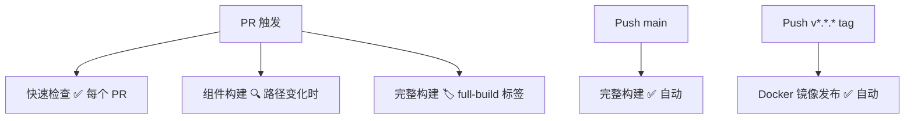

<PageHeader icon="🔄" title="CI/CD 文档" description="IMX-Forge 项目采用分层 CI 策略，平衡验证速度和完整性" />

## 工作流概览

| 工作流 | 触发条件 | 用途 |
|--------|----------|------|
| [PR Quick Checks](ci-pr.md) | 所有 PR <Badge type="info" text="~5min" /> | 快速验证基础问题 |
| [Component Build](ci-build.md) | 路径变化 <Badge type="info" text="~8-15min" /> | 只构建变更组件 |
| [Full Build](ci-full.md) | main / 标签 PR <Badge type="warning" text="~25-30min" /> | 完整 4 阶段构建 |
| [Docker Image Publish](docker-publish.md) | Tag / 手动 <Badge type="tip" text="~5-10min" /> | 构建发布 Docker 镜像 |

---

## PR 提交流程

<StepFlow>
  <StepItem icon="📝" title="打开 PR" />
  <StepItem icon="⚡" title="快速检查" description="ci-pr" time="~5min" />
  <StepItem icon="✅" title="通过验证" />
</StepFlow>

::: info 修改了特定文件？

| 修改路径 | 触发构建 |
|----------|----------|
| `patches/uboot/**` | U-Boot |
| `patches/linux-imx/**` | NXP BSP 内核 |
| `patches/linux-mainline/**` | Mainline 内核 |
| `driver/**` | 驱动示例 |

**ci-build** 只构建你修改的部分，节省时间。
:::

::: warning 需要完整验证？
给 PR 添加 `full-build` 标签即可触发 **ci-full**：

Stage 1: U-Boot → Stage 2: 双内核并行 → Stage 3: BusyBox → Stage 4: RootFS
:::

---

## 完整触发矩阵

| 你的操作 | ci-pr | ci-build | ci-full | docker-publish |
|----------|-------|----------|---------|----------------|
| 打开/更新 PR | ✅ 自动运行 | 🔍 路径触发 | ❌ | ❌ |
| 给 PR 加 `full-build` 标签 | ✅ | 🔍 | ✅ 运行 | ❌ |
| 合并到 main | ❌ | ❌ | ✅ 自动运行 | ❌ |
| 推送 `v*.*.*` tag | ❌ | ❌ | ❌ | ✅ 自动运行 |

---

## 触发决策

::: tip 发布方式
v1.0.0 不设置单独的 Release workflow，也不随 GitHub Release 交付官方 SD/eMMC binary 镜像。发布时创建 `v*.*.*` tag 触发 Docker 镜像发布；源码、发布说明和文档站作为主要交付内容。
:::

---

## 详细文档

<ChapterNav variant="sub">
  <ChapterLink href="ci-pr" variant="sub">PR Quick Checks — 快速检查详解</ChapterLink>
  <ChapterLink href="ci-build" variant="sub">Component Build — 组件构建详解</ChapterLink>
  <ChapterLink href="ci-full" variant="sub">Full Build — 完整构建详解</ChapterLink>
  <ChapterLink href="docker-publish" variant="sub">Docker Image Publish — 镜像发布详解</ChapterLink>
</ChapterNav>

<ChapterNav variant="sub">
  <ChapterLink href="../" variant="sub">← 返回文档首页</ChapterLink>
</ChapterNav>
